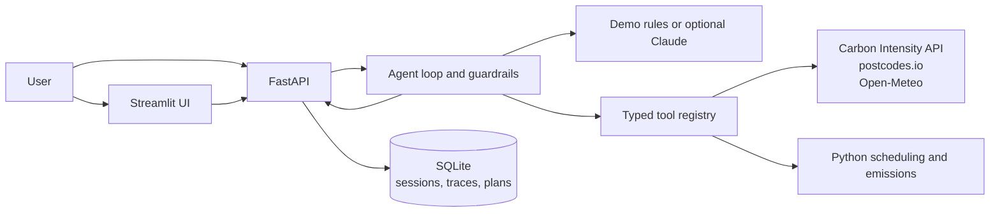

# Carbon Window Agent

Find lower-carbon times to run flexible electrical loads in Great Britain. Ask
about local grid intensity, estimate a load's emissions, or schedule an EV,
heat pump or household device around the carbon forecast. Plans wait for human
approval; the app never controls a device.

The project runs locally with a free, deterministic rules demo. Claude is an
optional provider and requires a separately billed Anthropic API key.

## Why use it?

Electricity has a carbon intensity: an estimate of the CO₂ associated with
each kilowatt-hour used. That estimate changes throughout the day as demand,
weather and the generation mix change. If an EV charge or appliance cycle can
wait, this project helps compare forecast hours for the same task and shows
the assumptions behind the result.

You do not need to make carbon your top priority. Use the schedule only when
it fits your routine or when you need a traceable estimate for awareness or
reporting. The app does not compare tariffs, promise bill savings or control
your equipment. If cost or convenience matters more, follow your tariff and
your normal schedule.


## What it does

- Retrieves regional UK carbon-intensity forecasts using a postcode or outcode.
- Finds the lowest-carbon interval for a flexible load using deterministic,
  tested Python scheduling functions.
- Estimates load emissions when you provide energy use in kWh.
- Records model and tool activity in a trace you can inspect for each answer.
- Plots the forecast timeline and highlights the selected run window.
- Explains the comparison against the earliest time you allowed.
- Saves requested plans as pending; a person must approve or reject them.
- Uses public carbon, postcode and weather services without provider API keys.

## Tech stack

| Area | Technologies |
|---|---|
| Language and validation | Python 3.11+, Pydantic v2 |
| API and server | FastAPI, Uvicorn, HTTPX |
| Optional interface | Streamlit |
| Persistence | SQLite |
| Data | NESO Carbon Intensity API, postcodes.io, Open-Meteo |
| Model providers | Free rules demo by default; optional Anthropic Claude Haiku |
| Quality | pytest, respx, Ruff, mypy, GitHub Actions |

## Architecture



The model selects tools and explains results. Python computes windows and
emissions, and every quantitative answer is checked against recorded tool
evidence. Tool outputs are treated as data, not instructions. The approval
endpoints are separate from the agent's tool allow-list.

## Quick start

Requires Python 3.11 or newer. The rules demo needs an internet connection for
live public data, but no model key or model API usage.

```sh
make install
make check
make run
```

The API listens on `http://127.0.0.1:8000`. To open the interface, run this in
a second terminal:

```sh
make ui
```

Then visit `http://localhost:8501`. The sidebar shows API connectivity and
which provider is active. The guided form builds a supported scheduling
question; the conversation view accepts follow-ups. Results include a forecast
timeline, an earliest-start comparison and assumptions. You can also try the API directly:

```sh
curl -s http://127.0.0.1:8000/ask \
  -H 'Content-Type: application/json' \
  -d '{"question":"When is the cleanest 4-hour window to charge my EV in RG1 tonight?"}'
```

Other useful prompts:

- “What is the current carbon intensity in RG1?”
- “Estimate emissions for a 2 kWh load in RG1 right now.”
- “Save a 4-hour, 8 kWh EV charging plan in RG1 tonight.”

For a trace in the terminal, run `make demo`. To use the recorded example
without network access, run `.venv/bin/python scripts/demo.py`; its forecast
is dated fixture data, not a live recommendation.

To launch the API with Docker, run `docker compose up --build`. Add the
optional Streamlit service with `docker compose --profile ui up --build`.

## Providers and costs

The default `PROVIDER=demo` is a narrow rules-based assistant. It records zero
model tokens and needs no LLM account. It is not a language model and does not
handle general conversation.

Claude is optional. To enable it, set `PROVIDER=anthropic`,
`ALLOW_PAID_API=true`, and `ANTHROPIC_API_KEY`; `MODEL` can override the model
name. Requests then use Anthropic's paid API, which is billed separately from
a ChatGPT subscription. See [Anthropic's current API pricing](https://platform.claude.com/docs/en/about-claude/pricing).
The local cost estimate is configured in `src/cwa/llm/pricing.py`. Never put
API keys in source control.

## Capabilities and limitations

Include a Great Britain postcode or outcode such as `RG1` for local results.
For a schedule, provide the device duration and the time range you can run it.
For an emissions estimate, provide energy use in kWh.

The application does **not** find public charge points, check charger
availability, give directions, compare electricity tariffs, or control
devices. It does not support town-name lookup or locations outside Great
Britain. Carbon forecasts can change, cover at most the available 48-hour
horizon, and may fall back to national data. Scheduling assumes one
uninterrupted run at constant power; estimated savings compare the recommended
window with the earliest start in the requested range. Weather data does not
predict a building's heat demand. Saved plans remain pending until a person
approves them.

The free rules demo recognizes a narrow set of question patterns. Ask directly
and use the examples above; ambiguous or unrelated questions may need
rephrasing. The optional Claude provider is more flexible in conversation,
but it remains constrained by the same data sources and tools.

## Tests and evaluation

Run the project checks with `make check`, and the offline fixture replay with
`make eval`. The replay currently passes **40/40 infrastructure checks**. It
uses scripted responses with fixture-derived expected values; it does not
measure model reasoning, prompt quality, answer accuracy, or semantic
resistance to prompt injection. No paid model evaluation has been run.

CI runs Ruff, mypy, the test suite and offline replay on Python 3.11 and 3.12.
The test suite currently contains **88 tests**. Public API fixtures can be
refreshed with `make fixtures`; check their timestamps and URLs in
`evals/fixtures/manifest.json` before committing them.

## Project guide

- `src/cwa/agent/loop.py` — bounded tool loop, validation and trace records.
- `src/cwa/runtime.py` — tool composition and provider selection.
- `src/cwa/tools/scheduling.py` — pure window and emissions calculations.
- `src/cwa/api/main.py` — API endpoints and error handling.
- `ui/streamlit_app.py` — chat, trace viewer and plan review.
- `evals/` — fixture replay cases, grader and reports.
- `DECISIONS.md` — implementation choices and trade-offs.

## Run the replayed examples

The checked-in replay report is [`reports/replay_2026-09-29.md`](reports/replay_2026-09-29.md).
The deterministic fixture demo can be run with `make eval`; live model
comparisons are intentionally not configured, so the evaluation requires no
paid API calls.
